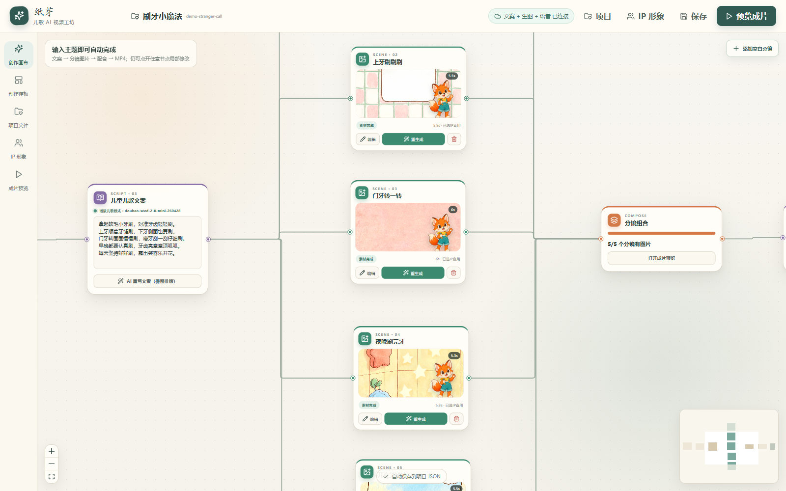

# 纸芽儿歌 AI 视频工坊

面向 3–7 岁儿童早教内容的可控视频生成网页。产品用节点画布管理项目、IP、儿歌文案、可变数量分镜、分层素材、配音、预览和导出；每个分镜都能单独编辑、删除、排序与重生成。



## 产品价值

生成式视频常见的问题不是“不能生成”，而是过程不可控、局部修改成本高。本项目把儿歌视频拆成项目、IP、文案、分镜、背景、角色、配音和渲染节点，让创作者可以逐步确认、单点重生成，并保留其他已满意的结果。

## 技术栈

- React + TypeScript + Vite：网页交互
- React Flow：可拖拽流程画布
- Express：密钥代理、项目隔离、素材目录与异步渲染任务
- 火山方舟 Doubao Seed 2.0 Mini：低成本儿童文案与结构化分镜生成
- 火山方舟 Seedream：背景与角色动作的真实图片生成
- Seed-TTS：真实 MP3 配音生成
- Sharp：纯绿背景角色自动抠图、透明 PNG 与边缘羽化
- Remotion Player / Renderer：浏览器实时预览与 H.264 MP4 导出

## 本地运行

根目录上一级的 `.env` 会被自动读取，前端不会接触密钥。

```powershell
pnpm install
pnpm dev
```

打开 `http://127.0.0.1:5173`。

## 当前默认

- 抖音竖屏 1080 × 1920、30fps
- 默认 30 秒、5 个分镜；可在输入节点修改数量，也可随时新增或删除
- 儿童剪纸绘本风格
- 背景与角色分开生成
- 角色全身自动去绿并输出真实透明 PNG；棋盘格预览可检查 Alpha
- 每个视频保存为独立的 `data/projects/*.json`
- 素材按 `public/projects/<项目ID>/images|audio|renders` 隔离
- MP4 在后台渲染，前端轮询显示阶段与百分比，完成后直接下载

## 核心体验

- 节点画布展示完整生产链路和当前状态
- 分镜数量可变，支持新增、删除、排序与逐镜重生成
- 背景和角色分层生成，角色自动去绿并保留透明通道
- 项目级素材隔离，避免不同视频的数据互相污染
- 浏览器实时预览，后台异步导出 H.264 MP4
- 自动化检查覆盖暂停恢复、重生成、文字质量和视觉渲染

## 仓库结构

```text
src/                 React 工作台与 Remotion 画面
server/              模型代理、项目服务与异步渲染
scripts/             产品流程与视觉自动化检查
quality/             UI、透明通道与渲染 QA 证据
deploy/              服务部署示例
```

## 我的工作

独立完成产品流程、节点画布交互、分镜与素材数据模型、模型接入、角色抠图、实时预览、异步渲染以及端到端质量检查。

## 后续扩展点

- 素材版本历史和人工验收状态
- 儿歌演唱模式、逐字字幕时间轴
- 对象存储与多人项目数据库

## 安全与素材说明

仓库不包含真实 API 密钥、用户项目数据、批量生成图片、音频或视频。`.env.example` 仅保留变量名和示例占位符。
