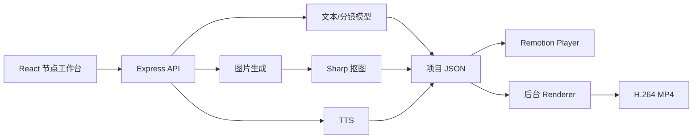

# 系统架构

```mermaid
flowchart LR
    A[React 节点工作台] --> B[Express API]
    B --> C[文本/分镜模型]
    B --> D[图片生成]
    B --> E[TTS]
    D --> F[Sharp 抠图]
    C --> G[项目 JSON]
    F --> G
    E --> G
    G --> H[Remotion Player]
    G --> I[后台 Renderer]
    I --> J[H.264 MP4]
```

服务端代理所有模型请求，浏览器不接触密钥。项目 JSON 保存可恢复的流程状态，素材目录按项目 ID 隔离。预览和最终渲染共享 Remotion composition，降低预览与成片差异。
